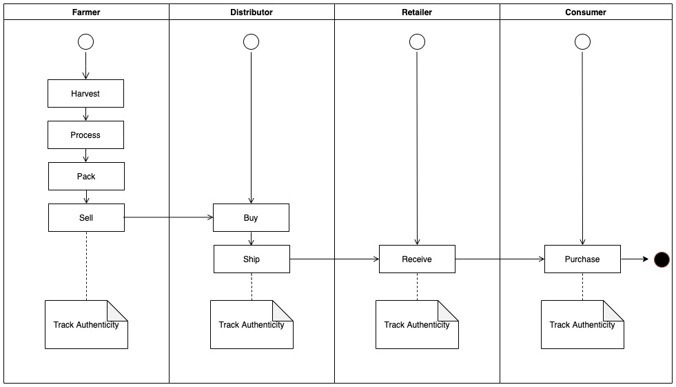
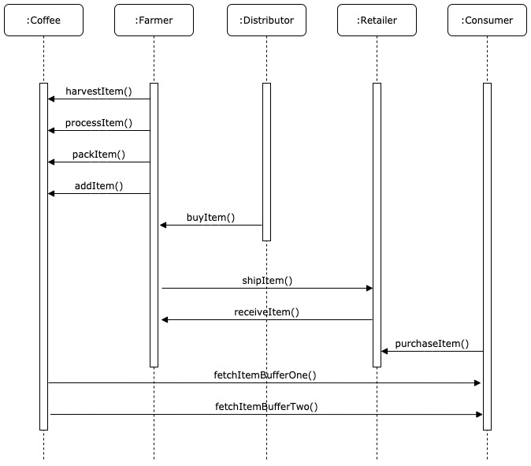
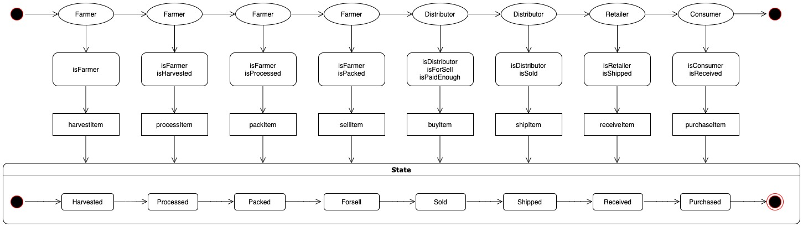
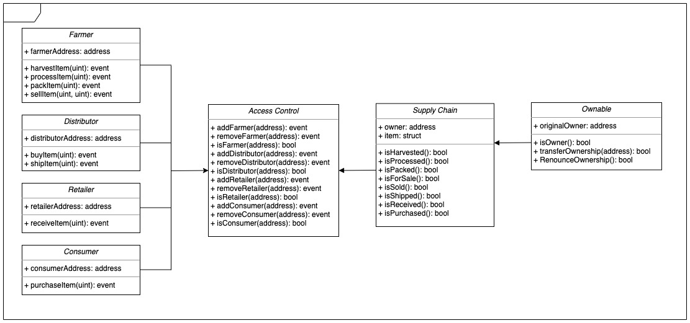

# Blockchain Supply Chain

## Requirements
- truffle
- truffle-hdwallet-provider (for rinkeby deployment)

## UML Diagrams


Activity Diagram



Sequence Diagram



State Diagram



Class Diagram



## How it works

For development:
1. Launch Ganache
2. Run:
```
$ truffle compile
$ truffle migrate --reset
$ truffle test
```
3. Run local server:
```
npm run dev
```

For Rinkeby:
1. Start up an Infury project and record the Rinkeby network address.
2. Run:
```
$ truffle compile
$ truffle migrate --reset --network rinkeby
$ truffle test
```

## IPFS
1. Start an IPFS daemon
```
$ ipfs daemon
```
2. Add the project in:
```
$ ipfs add index.html
```
3. By default, check the page on
```https://127.0.0.1:8080/ipfs/${HASH_OF_HTML}```
