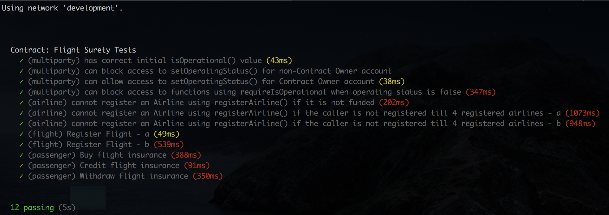
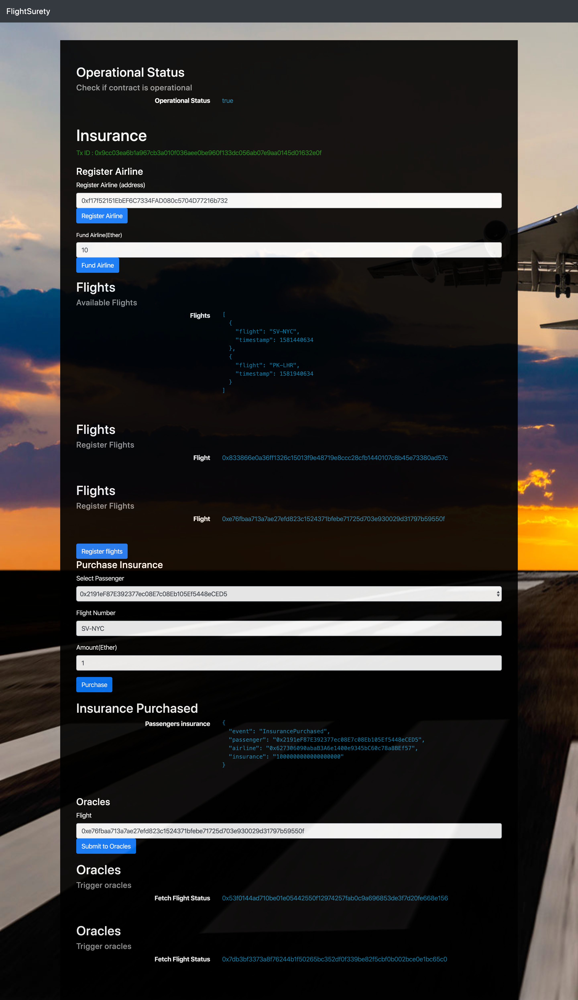

# FlightSurety

FlightSurety is a sample application project for Udacity's Blockchain course.

## Requirements
- Truffle v4.1.15 (core: 4.1.15)
- Solidity v0.4.25 (solc-js)

## Install

This repository contains Smart Contract code in Solidity (using Truffle), tests (also using Truffle), dApp scaffolding (using HTML, CSS and JS) and server app scaffolding.

To install, download or clone the repo, then:

```bash
$ npm install
$ truffle compile
```

## Develop Client

To run truffle tests:

```bash
$ truffle test ./test/flightSurety.js
$ truffle test ./test/oracles.js
```



To use the dapp:

```bash
$ truffle migrate --reset
$ npm run dapp
```

To view dapp:

`http://localhost:8000`

## Develop Server

```bash
$ truffle migrate --reset
$ npm run server
```


Tips:
Increase the number of accounts to 40 in Ganache to test.

HDWalletProvider cannot be used for an error of ```the tx doesn't have the correct nonce. account has nonce of: xx tx has nonce of: yy ```

## Deploy

To build dapp for prod:
`npm run dapp:prod`

Deploy the contents of the ./dapp folder


